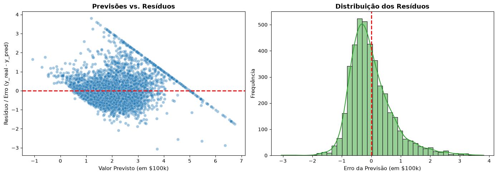

#California Housing Price Prediction: Linear Regression & Residual Diagnostics

Um pipeline de Machine Learning focado em boas práticas de de modelagem e Engenharia de Machine Learning para estimativa de preços de imóveis na Califórnia, utilizando o dataset estatístico do censo de 1990 (`fetch_california_housing`). 

O projeto prioriza a **prevenção contra vazamento de dados (Data Leakage)**, a interpretação estatística voltada a negócios e o diagnóstico gráfico de resíduos para identificar limitações estruturais dos dados originais.

---

## 1. Avaliação do Modelo e Impacto no Negócio

O desempenho do modelo foi quantificado sobre um conjunto de teste cego (20% dos dados, totalmente separados antes de qualquer etapa de normalização).

| Métrica | Valor Bruto | Significado no Negócio |
| :--- | :---: | :--- |
| **R² Score** | `0.5952` | **59.52%** da variação dos preços imobiliários é explicada pelas características da região. |
| **MAE** | `0.5515` | Erro médio operacional de **± $55.158,29** na estimativa de preço de uma vizinhança. |
| **RMSE** | `0.7385` | Erro com penalidade para grandes desvios extremos de **± $73.858,45**. |

### Interpretação Executiva dos Resultados
* **Eficiência do Modelo Linear:** Um R² de aproximadamente 60% representa o patamar padrão da literatura técnica para regressões lineares paramétricas neste dataset, capturando a tendência principal entre renda média da população (`MedInc`) e valorização imobiliária.
* **A Grande Descoberta (RMSE vs. MAE):** O RMSE é significativamente superior ao MAE (uma penalidade de cerca de **$18.700** mais alta). Matematicamente, isso comprova que o modelo comete erros de altíssima magnitude em imóveis específicos — um artefato diretamente conectado à restrição da coleta original dos dados.

---

## 2. Diagnóstico Visual de Resíduos e o "Efeito dos 500k"



A avaliação visual dos erros (Resíduo = Valor Real - Valor Previsto) releva as seguintes propriedades do modelo:

1. **Ausência de Viés Sistemático:** A curva de densidade dos resíduos (histograma) segue uma distribuição normal centrada no zero. O modelo não superestima nem subestima sistematicamente a média geral do mercado.
2. **O Artefato do Teto de $500k:** O gráfico de dispersão exibe uma **linha diagonal nítida de corte** na parte superior. O censo americano de 1990 registrou qualquer imóvel de valor igual ou superior a $500.000 como um valor fixo de $500.001. Quando o modelo (seguindo a tendência contínua da alta renda) prevê casas de luxo valendo $600k ou $700k, o resíduo gerado contra o teto artificial gera erros pontuais superiores a $150k, disparando o valor do RMSE.
3. **Falta de Variáveis Estruturais:** A dispersão ligeiramente heterocedástica nas faixas mais altas aponta que variáveis agregadas por bloco demográfico (renda, localização geográfica e média de cômodos) são insuficientes para diferenciar propriedades de alto padrão de casas convencionais.

---

## 3. Boas Práticas de Machine Learning e Engenharia Adotadas

* **Prevenção Estrita de Data Leakage:** A separação entre conjuntos de treino (80%) e teste (20%) via `train_test_split` ocorre antes de qualquer etapa de feature engineering ou pré-processamento.
* **Normalização Segura:** O `StandardScaler` tem seus parâmetros de média e desvio padrão ajustados (`fit`) **apenas nos dados de treino**, sendo aplicados (`transform`) no conjunto de teste sem transferir estatísticas da avaliação cega.
* **Controle de Versão Técnico:** Versionamento limpo via Git, seguindo a especificação de semântica do **Conventional Commits** (`feat:`, `docs:`, `fix:`), garantindo rastreabilidade no histórico de desenvolvimento.

---

## 4. Como Executar o Projeto

### Pré-requisitos
* Python 3.9+
* Git

### Passos para rodar localmente

1. Clone o repositório principal:
```bash
git clone [https://github.com/Vinims30/ml-foundations-lab.git](https://github.com/Vinims30/ml-foundations-lab.git)
cd ml-foundations-lab/01-linear-regression

2. Crie e ative um ambiente virtual:
python -m venv venv
# Linux / macOS
source venv/bin/activate  
# Windows
venv\Scripts\activate

3. Instale as dependências técnicas:
pip install -r requirements.txt

4. Execute o Jupyter Notebook para visualizar a análise completa e os gráficos:
jupyter notebook desafio_california.ipynb